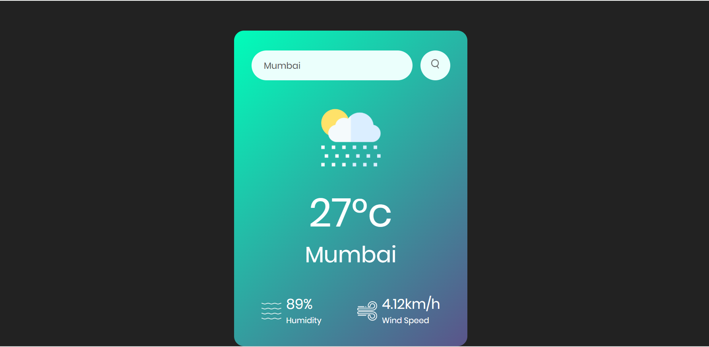

# 🌤️ Weather App

A simple and responsive Weather App built using HTML, CSS, and JavaScript. 
The application allows users to search for a city and view its current weather information.

## 🚀 Features

- 🌍 Search weather by city
- 🌡️ Displays current temperature
- 💧 Shows humidity
- 💨 Displays wind speed
- ☁️ Shows weather condition
- 📱 Responsive design
- ⚡ Real-time weather data using an API
- ❌ Error handling for invalid city names

## 🛠️ Technologies Used

- HTML5
- CSS3
- JavaScript
- Weather API

## 📖 How to Use

1. Enter a city name in the search box.
2. Click the **Search** button.
3. The app fetches the latest weather information.
4. View the temperature, humidity, wind speed, and weather condition.

## 📸 Screenshots

## 🌐 Live Demo

 [Click here to view the Weather App](https://sujalpiprikar01.github.io/Weather-app/)

## 👨‍💻 Author

**Sujal Piprikar**

GitHub: https://github.com/sujalpiprikar01
